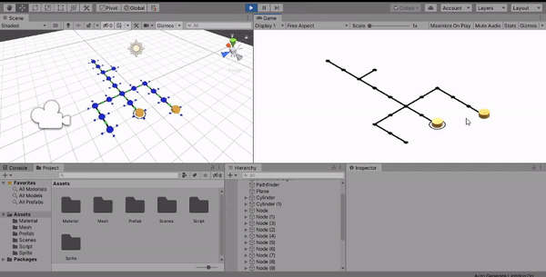

# nodal-pathfinder
This is a toolkit to create modular paths unsing nodes on Unity [2019.3.0f6](https://unity3d.com/pt/unity/whats-new/2019.3.0 "Release Notes"). The pathfinding was based in the [A* algorithm](http://theory.stanford.edu/~amitp/GameProgramming/AStarComparison.html#the-a-star-algorithm "An introduction to A* Algorithm").

